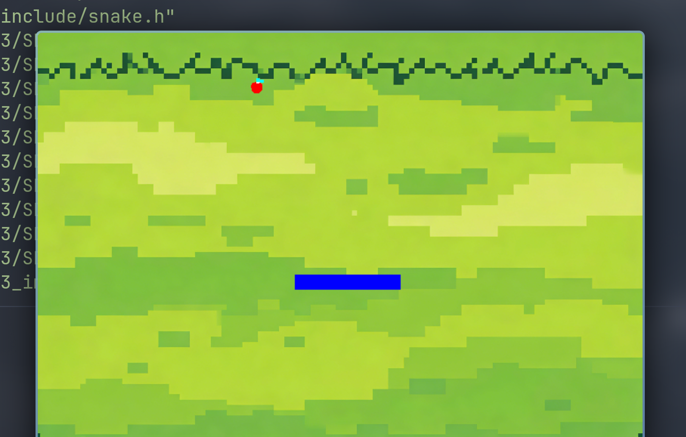

# C 语言课程设计综合题游戏
使用 SDL3 图形库编写贪吃蛇  
窗口大小 600 * 800
需要依赖： SDL3 SDL_image SDL_ttf  
ArchLinux 可运行以下命令进行安装：  
``` shell
sudo pacman -S sdl3 sdl3_image sdl3_ttf
```
使用 make 编译

## 目前进度:  

课程设计第一天:  
学会 SDL3 的使用  
完成基本基本的贪吃蛇功能  

## TODO  
- [ ] 蛇的图片
- [x] 分数栏
- [ ] 死亡窗口
- [ ] 分数存储

## 代码量
```
❯ git ls-files '*.cpp' '*.h' | xargs wc -l
   10 include/food.h
   34 include/game.h
   23 include/snake.h
   12 include/win.h
    6 main.cpp
   92 src/food.cpp
  101 src/game.cpp
  121 src/snake.cpp
  121 src/win.cpp
  520 total
```

## 结构
```
❯ tree
.
├── compile_commands.json
├── img
│   └── 1.png
├── include
│   ├── food.h
│   ├── game.h
│   ├── snake.h
│   └── win.h
├── main.cpp
├── Makefile
├── readme.md
├── sources
│   ├── apple.png
│   └── background.png
└── src
    ├── food.cpp
    ├── game.cpp
    ├── snake.cpp
    └── win.cpp

5 directories, 15 files
```
